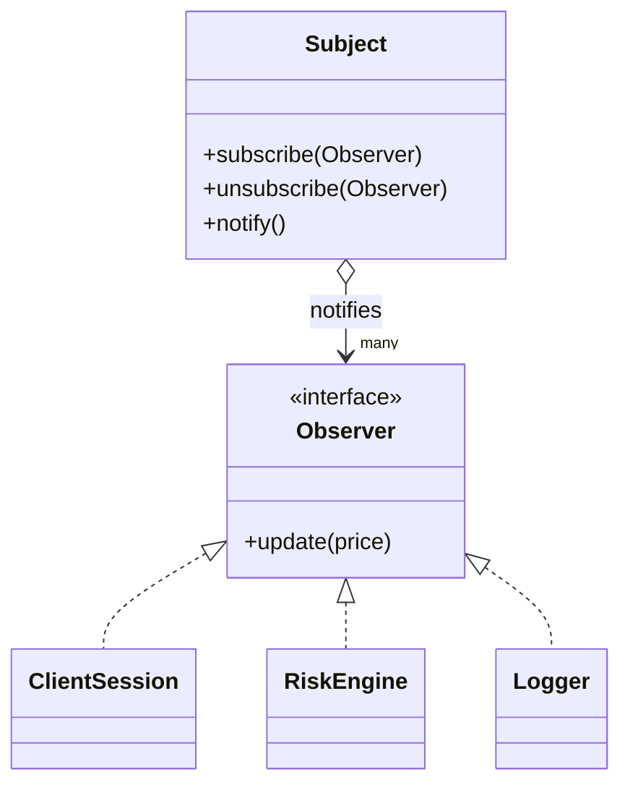

# Observer design pattern 
- a behavioral design pattern where one to many dependcy between objects so that one object changes state, all dependent object update themselves automatically

# Problem: 
There are many objects dependent on an object's state change. All dependent object should be able to know the state update of the observed object and update themselves.

# Parts

- Observee/Subject : The object of interest for which state updates are watched
- Observer/Subscriber : The dependent objects which are interested in subject's state change

# How: 
For the state update of interested object, instead of dependent object checking it's state all the time, it registers the dependent object to the observed object. Whenver observed object changes it's state it notify all dependent objects and allow them to update themselves.
**Subject** 
- hold the list of dependent objects (the list of subscribers),
- it have notify or similar method to update all of it's observers/subscribers to know that the subject's state has changed.
- Give method to registers/subscribe to allow it's dependent objects to register them on the subject

**Observers**
- Provides notify method which will be called by subject when there is a state change of it.
- Probe the subject's state/request data from subject when there is any change or data can be passed directly when it's notified

# Structure


  
# Real world examples
- Price ticks in pricing systems
In pricing systems, When there is a price change in some instrument, there are many client/downstream apps are required to know the price changes(tick). Whoever interested into particular instrument, subscribe to the instrument on the service which serves the instruments ticks and data.
It provide flexibility to subscribe/unsubscribe the instruments of interest.

#code examples

```cpp
#include <vector>
#include <memory>
#include <algorithm>

struct Tick { double price; /* ... */ };

// Observer interface
class PriceObserver {
public:
    virtual void update(const Tick& tick) = 0;   // Subject pushes the tick
    virtual ~PriceObserver() = default;
};

// Subject
class Instrument {                                 // the observed object
    std::vector<std::weak_ptr<PriceObserver>> observers_;  // weak_ptr -> see below
public:
    void subscribe(std::shared_ptr<PriceObserver> o) {
        observers_.push_back(o);
    }
    void notify(const Tick& tick) {
        // prune dead observers while notifying
        for (auto it = observers_.begin(); it != observers_.end(); ) {
            if (auto obs = it->lock()) {           // still alive?
                obs->update(tick);
                ++it;
            } else {
                it = observers_.erase(it);         // expired ? remove
            }
        }
    }
    void onNewTick(const Tick& tick) {             // state change ? notify
        notify(tick);
    }
};

// A concrete observer
class ClientSession : public PriceObserver {
public:
    void update(const Tick& tick) override {
        // send tick to the connected client
    }
};

```

weak_ptr used here which solves the lifetime problem - if an observer get destroyed with unsubscribing from subject then observer object becomes dangling pointer on subject side and give undefined behaviour.

